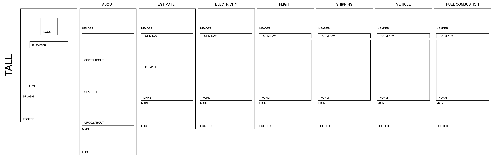

# sqstr

#### A React application for an explosive fireworks popup

#### By Jonathan Stull

## **Table of Contents**

 

* <a href="#about-sqstr">About sqstr</a>
    * <a href="#technologies-used">Technologies Used</a>
* <a href="#Component-Architecture">Component Architecture</a>
* <a href="#Set-Up-instructions">Set Up Instructions</a>
* <a href="#known-bugs">Known Bugs</a>
* <a href="#License">License</a>
* <a href="#Acknowledgements">Acknowledgements</a>
* <a href="#Contact-Information">Contact Information</a>

 

### About the POWDER KEG

 

Right now, there is an emerging market for carbon-based cryptocurrency and an urgent climate crisis. While the emphasis of solutions should be placed on collective action that includes our largest institutions, there does not currently exist a consumer-level service that can estimate individual carbon emissions and recommend direct action in the form of a carbon-based token investment.

sqstr will change that by providing an engine that recommends the amount of carbon tokens an individual should buy based on the carbon-emitting activities they engage in&mdash;flights, drives, consumed electricity, and a handful of other carbon-intensive activities.

This tool gathers user input required to formulate a carbon emissions estimate in tonnes backed by a science-based and peer-reviewed methodology. This figure is cross-referenced with the current value of the [UPCO2 carbon-based token](https://universalcarbon.com/) to provide a recommended investment to partly or wholly offset individual carbon emissions.

Please refer to [this document](https://docs.google.com/document/d/1gj2tSQHACrTMs-uJwD7F2ukDU3sUlKNQhkFyihKCDO4/edit?usp=sharing) to see additional project details.

 

## Component Architecture

## Technologies Used

 

- React
- VS Code

 

## Setup Instructions

### Prerequisites

 

- A text editor like [VS Code](https://code.visualstudio.com/)

 

### Installation

 

1. Clone repository: `git clone https://github.com/mountainfawkes/sqstr`.
2. Navigate to the `/sqstr` directory
3. Open with your preferred text editor to view the code base

 

- #### **Run the Program**

 

1. Nagivate to project folder using `cd /sqstr`
2. `npm install` to install dependencies.
3. `npm start` to run application server
4. Open http://localhost:3000/ in your preferred browser

 

### Known Bugs

 

* Dependency conflicts have dogged this project since its inception; these may only materialize locally on systems with dependency conflicts higher up in the dependency tree. If necessary, navigate to your root directory to explore the global `node_modules` in the event that dependency conflicts arise. Babel and React Scripts were especially problematic in sqstr's development environment.

 

### License

 

Copyright (c) 2021 by [Jonathan Stull](https://github.com/jonathanstull)

Permission is hereby granted, free of charge, to any person obtaining a copy of this software and associated documentation files (the "Software"), to deal in the Software without restriction, including without limitation the rights to use, copy, modify, merge, publish, distribute, sublicense, and/or sell copies of the Software, and to permit persons to whom the Software is furnished to do so, subject to the following conditions:

The above copyright notice and this permission notice shall be included in all copies or substantial portions of the Software.

THE SOFTWARE IS PROVIDED "AS IS", WITHOUT WARRANTY OF ANY KIND, EXPRESS OR IMPLIED, INCLUDING BUT NOT LIMITED TO THE WARRANTIES OF MERCHANTABILITY, FITNESS FOR A PARTICULAR PURPOSE AND NONINFRINGEMENT. IN NO EVENT SHALL THE AUTHORS OR COPYRIGHT HOLDERS BE LIABLE FOR ANY CLAIM.cs, DAMAGES OR OTHER LIABILITY, WHETHER IN AN ACTION OF CONTRACT, TORT OR OTHERWISE, ARISING FROM, OUT OF OR IN CONNECTION WITH THE SOFTWARE OR THE USE OR OTHER DEALINGS IN THE SOFTWARE.

 

## **Acknowledgements**

 

This project was developed alongside the [LearnHowToProgram curriculum](learnhowtoprogram.com) at Epicodus, a coding bootcamp in Portland, Oregon.

This app would not have been possible without the amazing cohort I studied with at Epicodus. A special thanks goes to [Erik Irgens](https://github.com/erik-t-irgens) and [James Henager](https://github.com/jhenager), whose consistent presence and demos of state and classic RPG victory jingles have been instrumental in keeping the torrid pace of Epicodus managable.

 

#### Contact Information

- Jonathan Stull: jonathan.d.stull@gmail.com
